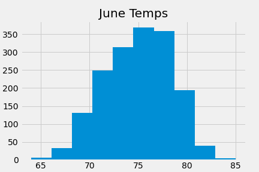
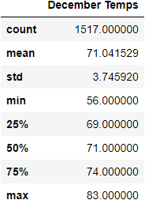
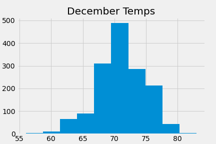

# SurfsUp
Temperature data for the months of June and December in Oahu, in order to determine if a surf and ice cream shop business is sustainable year-round.

## Background
W. Avy likes your analysis, but he wants more information about temperature trends before opening the surf shop. Specifically, he wants temperature data for the months of June and December in Oahu, in order to determine if the surf and ice cream shop business is sustainable year-round.

## Method
* Deliverable 1: Determine the Summary Statistics for June
* Deliverable 2: Determine the Summary Statistics for December
* Deliverable 3: A written report for the statistical analysis (README.md)

## Findings

### June Weather Summary
* The average temperature for Oahu, HI during the month of June was 74.9°F.
* The highest temperature was 85.0°F
* The lowest temperature was 64.0°F

### December Weather Summary
* The average temperature for Oahu, HI during the month of June was 71.0°F.
* The highest temperature was 83.0°F
* The lowest temperature was 56.0°F

### Comparison of June vs. December Temperature
On average, temperatures for Oahu, HI are 3° warmer in June compared to December.
While the highest temperature is within 2° for both June and December, the lowest temperature is 8° lower in December compared to June. 
Each month has over 1500 collecions for temperature.
While the weather looks great for each month, I would consider looking into rainfall for each month and how that affects the local area.
When determing if the surf and ice ceam shop is sustainable year round, we can look into areas that are popular among locals compared to tourists hot spots. While an area popular with tourists can have huge success during tourist seasons, a well established venue can be a treasure amoung the locals year round.